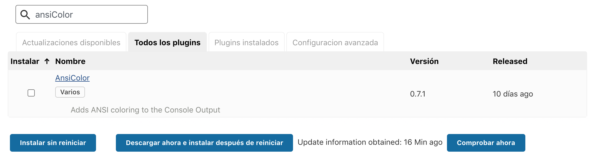
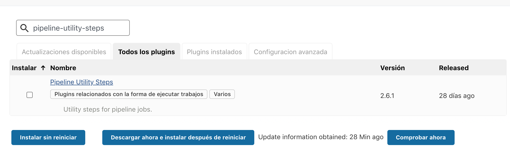
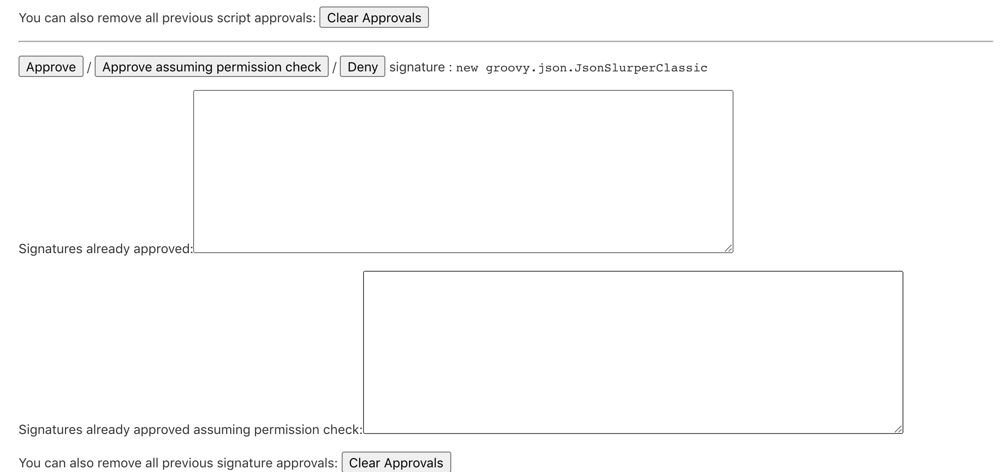

# SharedLibraries

Ejercicio sobre libreria dinamica de Jenkins, lo que se presenta en la libreria base y esta llama a otra que esta en un repositorio privado.

## Configuración de Jenkins

- Instalar plugin ansiColor

- Instalar plugin pipeline-utility-steps

- Video demostración

- Aceptar ejecución de scripts:
    * method groovy.json.JsonSlurperClassic parseText java.lang.String
    * new groovy.json.JsonSlurperClassic

